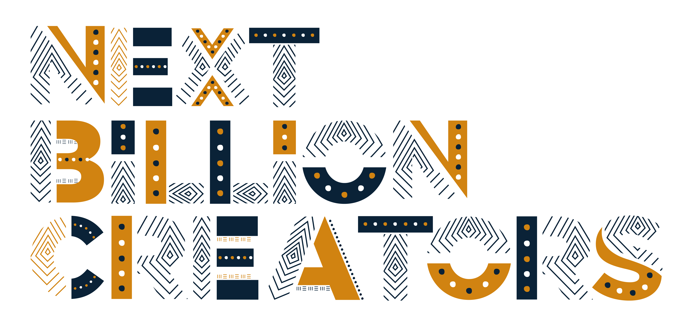

<div align="center"  style="margin-bottom:30px">
    
</div>

## Getting Started

- Fork this repository

- Clone the forked repository like so:

```shell
git clone https://github.com/<your username>/oscommunityafrica.github.io.git && cd oscommunityafrica.github.io
```

- Switch to the **new-festival** branch

```shell
git checkout new-festival
```

## Gatsby Setup

- Install the Gatsby CLI

```
npm install -g gatsby-cli
```

- Change directories into site folder

```
cd oscommunityafrica.github.io
````

- Start development server

```
gatsby develop
```
Gatsby will start a hot-reloading development environment a